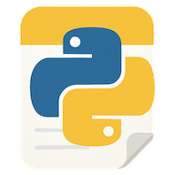

# Apple Notes Python API

A Python API to interact with Apple's Notes app.

## Usage

### CLI

Get note content:

```sh
apple-notes get note "My Note Title"
```

List notes in a folder:

```sh
apple-notes list notes "My Folder"
```

Create a note with text:

```sh
apple-notes create note "My New Note" "This is the content"
```

Create a note with piped content:

```sh
echo "This is piped content" | apple-notes create note "My New Note"
```

Delete a note:

```sh
apple-notes delete note "My Note Title"
```

Create a folder:

```sh
apple-notes create folder "My New Folder"
```

Delete a folder:

```sh
apple-notes delete folder "My Folder"
```

Open a note:

```sh
apple-notes open "My Note Title"
```

### Python API

```python
from apple_notes import api
```

Get note content:

```python
content = api.get_note("My Note Title")
print(content)
```

List notes in a folder:

```python
notes = api.get_notes_in_folder("My Folder")
for note in notes:
    print(note.title)
```

Create a note:

```python
api.create_note("My New Note", "This is the content", folder="Notes")
```

Delete a note:

```python
api.delete_note("My Note Title")
```

Create a folder:

```python
api.create_folder("My New Folder")
```

Delete a folder:

```python
api.delete_folder("My Folder")
```

Open a note:

```python
api.open_note("My Note Title")
```

## Development

Clone the repository:

```sh
git clone https://github.com/floscha/apple-notes-python.git
```

Install from repository:

```sh
uv tool install -e .
```

Run the tests:

```sh
uvx pytest
```
